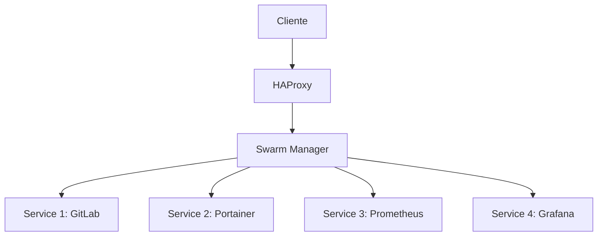
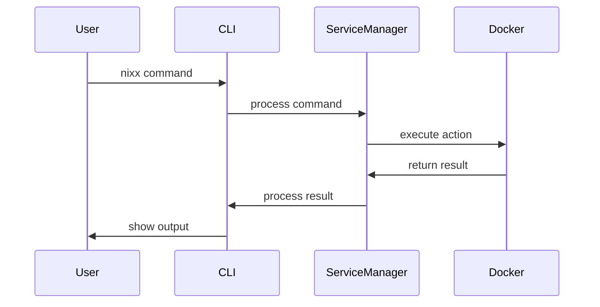

# Nixx CLI - Documentação Completa

<div align="center">
  
  <h3>Sistema de Gerenciamento DevOps Integrado</h3>
  <p>Uma ferramenta completa para gerenciamento de infraestrutura DevOps</p>
</div>

## 📑 Sumário
- [Introdução](#introdução)
- [Instalação](#instalação)
- [Arquitetura](#arquitetura)
- [Casos de Uso](#casos-de-uso)
- [Configuração Avançada](#configuração-avançada)
- [Integrações](#integrações)
- [Migração](#migração)
- [Troubleshooting](#troubleshooting)
- [Performance](#performance)
- [Segurança](#segurança)
- [Contribuindo](#contribuindo)
- [FAQ](#faq)

## 🚀 Introdução

### O que é o Nixx CLI?
Nixx CLI é uma ferramenta de linha de comando que simplifica o gerenciamento de infraestrutura DevOps, fornecendo uma interface unificada para gestão de containers, monitoramento, CI/CD e muito mais.

### Características Principais
- 🐳 Gerenciamento Docker avançado
- 📊 Monitoramento em tempo real
- 🔄 CI/CD integrado
- 🔒 Gestão de segurança
- 💾 Backup e restore
- 🌐 Gestão de rede
- 📝 Logging centralizado
- ⚡ Alta disponibilidade

### Requisitos do Sistema
- **Sistema Operacional:** Ubuntu 20.04+ ou Debian 11+
- **Hardware Mínimo:**
  - CPU: 2+ cores
  - RAM: 4GB (recomendado 8GB+)
  - Disco: 20GB+ livre
- **Software:**
  - Docker 20.10+
  - Git 2.25+
  - curl
  - jq

## 💻 Instalação

### Instalação Automática
```bash
curl -fsSL https://raw.githubusercontent.com/nixx-cli/main/install.sh | sudo bash
```

### Instalação Manual

# Download do instalador
wget https://raw.githubusercontent.com/seu-usuario/nixx-cli/main/install.sh

# Tornar executável
chmod +x install.sh

# Executar instalador
sudo ./install.sh

### Pós-instalação
```bash
# Configure o ambiente
nixx config init

# Verifique os requisitos
nixx system check

# Inicialize o ambiente
nixx install main
```

### Configuração Inicial
```bash
# Defina as variáveis globais
nixx config set DOCKER_REGISTRY "seu-registry.com"
nixx config set DEFAULT_DOMAIN "seu-dominio.com"
nixx config set BACKUP_RETENTION 7

# Configure as credenciais (opcional)
nixx credentials setup
```

## 🏗 Arquitetura

### Visão Geral da Arquitetura


### Componentes Principais
1. **Core:**
   - CLI Handler
   - Service Manager
   - Network Manager
   - Security Manager

2. **Serviços:**
   - Container Management
   - Monitoring
   - CI/CD
   - Backup/Restore

3. **Utilitários:**
   - Logger
   - Config Manager
   - Diagnostics
   - Health Checker

### Estrutura de Diretórios
```
nixx-cli/
├── bin/                  # Binários e scripts
├── src/                  # Código fonte
│   ├── commands/        # Comandos CLI
│   ├── utils/          # Utilitários
│   └── templates/      # Templates
├── docs/               # Documentação
├── tests/              # Testes
└── scripts/            # Scripts auxiliares
```

### Fluxo de Dados


## 💡 Casos de Uso

### 1. Startup em Crescimento

#### Cenário
Startup precisa escalar rapidamente sua infraestrutura mantendo qualidade e segurança.

#### Solução
```bash
# 1. Configuração inicial com HA
nixx install main --ha \
  --managers 3 \
  --backup enabled \
  --monitoring enabled

# 2. Pipeline CI/CD
nixx create gitlab --enterprise
nixx gitlab ci setup --auto-devops

# 3. Monitoramento
nixx create prometheus --retention 30d
nixx create grafana --dashboards auto
nixx create alert-manager

# 4. Escalabilidade
nixx scale workers add --count 5 --auto-scale true
```

### 2. Migração de Ambiente Legacy

#### Cenário
Empresa precisa migrar aplicações legadas para containers.

#### Solução
```bash
# 1. Análise do ambiente atual
nixx analyze legacy-app \
  --path /var/www/app \
  --type php \
  --dependencies true

# 2. Geração de Dockerfiles
nixx generate dockerfile \
  --from analysis \
  --optimize true

# 3. Migração de dados
nixx migrate database \
  --source mysql://old-db \
  --target container

# 4. Deploy gradual
nixx deploy rolling \
  --source legacy \
  --target container \
  --rollback-plan auto
```

### 3. Ambiente de Desenvolvimento Complexo

#### Cenário
Equipe grande precisando de ambientes isolados mas integrados.

#### Solução
```bash
# 1. Criar ambientes
nixx environment create dev --team backend
nixx environment create dev --team frontend
nixx environment create staging

# 2. Configurar integrações
nixx integrate gitlab --env dev
nixx integrate jira --env all

# 3. Pipeline por ambiente
nixx pipeline create --env dev \
  --steps "lint,test,build" \
  --auto-deploy false

nixx pipeline create --env staging \
  --steps "test,security,deploy" \
  --auto-deploy true
```

## ⚙️ Configuração Avançada

### High Availability Setup

```bash
# 1. Configurar Cluster HA
nixx cluster create \
  --name production \
  --managers 3 \
  --workers 5 \
  --availability-zones "a,b,c"

# 2. Configurar Load Balancer
nixx lb create \
  --type haproxy \
  --nodes "node1,node2,node3" \
  --ssl auto \
  --sticky-sessions true

# 3. Configurar Backup
nixx backup configure \
  --type s3 \
  --bucket my-backups \
  --schedule "0 */6 * * *" \
  --retention 30d
```

### Performance Tuning

```bash
# 1. Otimização de recursos
nixx tune resources \
  --cpu-allocation optimized \
  --memory-limits auto \
  --io-priority high

# 2. Cache e armazenamento
nixx tune storage \
  --cache-size 2GB \
  --volume-driver overlay2 \
  --compression true

# 3. Rede
nixx tune network \
  --mtu 9000 \
  --tcp-keepalive 300 \
  --dns-cache-size 4096
```

### Configuração de Segurança

```bash
# 1. Hardening básico
nixx security harden \
  --level production \
  --audit true

# 2. Configuração de TLS/SSL
nixx security certificates \
  --type letsencrypt \
  --domains "*.company.com" \
  --auto-renew true

# 3. Políticas de acesso
nixx security policies \
  --rbac enabled \
  --2fa required \
  --audit-log enabled
```

### Monitoramento Avançado

```bash
# 1. Métricas customizadas
nixx monitor metrics create \
  --name app_performance \
  --type gauge \
  --labels "env,service"

# 2. Dashboards
nixx monitor dashboard create \
  --name "SRE Overview" \
  --metrics "cpu,memory,app_performance" \
  --refresh 30s

# 3. Alertas
nixx monitor alerts create \
  --condition "cpu_usage > 80%" \
  --duration 5m \
  --action "slack,email"
```

## 🔌 Integrações

### Integração com CI/CD

#### GitLab Integration
```bash
# 1. Configuração básica
nixx integrate gitlab \
  --url "https://gitlab.company.com" \
  --token "seu-token" \
  --runners-count 3

# 2. Pipeline automática
nixx gitlab pipeline create \
  --type auto-devops \
  --language nodejs \
  --environments "stage,prod"

# 3. Configurar Registry
nixx gitlab registry setup \
  --ssl true \
  --cleanup-policy "7d"
```

#### GitHub Integration
```bash
# 1. Configuração do GitHub Actions
nixx integrate github \
  --org "sua-org" \
  --token "seu-token" \
  --runners-type self-hosted

# 2. Configurar Secrets
nixx github secrets set \
  --repo "app" \
  --secrets "DB_PASS,API_KEY"

# 3. Deploy Keys
nixx github deploy-key add \
  --repo "app" \
  --name "production"
```

### Integração com Monitoramento

#### Datadog Integration
```bash
# 1. Setup inicial
nixx integrate datadog \
  --api-key "sua-key" \
  --app-key "sua-app-key" \
  --tags "env:prod"

# 2. Métricas customizadas
nixx datadog metrics create \
  --name "app.performance" \
  --type gauge

# 3. Dashboards
nixx datadog dashboard create \
  --name "SRE Overview" \
  --widgets "metrics,logs,apm"
```

#### Grafana Cloud
```bash
# 1. Configuração
nixx integrate grafana-cloud \
  --url "sua-url" \
  --token "seu-token"

# 2. Datasources
nixx grafana datasource add \
  --type prometheus \
  --url "http://prom:9090"

# 3. Alerting
nixx grafana alert create \
  --name "High CPU" \
  --condition "cpu > 80"
```

## 🔍 Troubleshooting

### Diagnóstico Avançado

#### Análise de Sistema
```bash
# 1. Verificação completa
nixx diagnose system \
  --deep \
  --timeout 300s \
  --output report.json

# 2. Análise de recursos
nixx analyze resources \
  --historical 7d \
  --metrics "cpu,memory,io"

# 3. Verificação de rede
nixx diagnose network \
  --ports \
  --connections \
  --dns
```

#### Debug de Serviços
```bash
# 1. Debug de container
nixx debug container gitlab \
  --logs \
  --events \
  --processes

# 2. Análise de volume
nixx debug volume gitlab-data \
  --usage \
  --permissions \
  --corruption

# 3. Debug de rede
nixx debug network monitoring \
  --packets \
  --latency \
  --dns
```

### Recuperação de Falhas

#### Backup e Restore
```bash
# 1. Backup de emergência
nixx backup create emergency \
  --services "all" \
  --compress true \
  --verify true

# 2. Restore seletivo
nixx restore selective \
  --service gitlab \
  --point-in-time "2h ago" \
  --verify true

# 3. Validação
nixx verify restore \
  --service gitlab \
  --checks "data,config,perms"
```

#### Reparo de Sistema
```bash
# 1. Reparo de volumes
nixx repair volumes \
  --check \
  --fix \
  --verify

# 2. Reconstrução de índices
nixx repair indexes \
  --service gitlab \
  --optimize true

# 3. Limpeza de sistema
nixx system cleanup \
  --dangling \
  --unused \
  --logs
```

## 🔒 Segurança

### Hardening do Sistema

#### Configuração Básica
```bash
# 1. Auditoria inicial
nixx security audit \
  --level complete \
  --output audit.json

# 2. Aplicar recomendações
nixx security harden \
  --recommendations audit.json \
  --backup true

# 3. Verificar mudanças
nixx security verify \
  --audit audit.json \
  --report changes.json
```

#### Configuração Avançada
```bash
# 1. AppArmor/SELinux
nixx security profiles create \
  --service gitlab \
  --type apparmor \
  --template strict

# 2. Secrets Management
nixx security secrets \
  --backend vault \
  --auto-rotate true

# 3. Network Policies
nixx security network \
  --default-deny \
  --rules "policies/prod"
```

### Monitoramento de Segurança

#### Detecção de Ameaças
```bash
# 1. Configurar scanning
nixx security scan setup \
  --type "vulnerability,compliance" \
  --schedule "0 */4 * * *"

# 2. Monitoramento
nixx security monitor \
  --events "auth,network,files" \
  --alert-channel slack

# 3. Relatórios
nixx security report \
  --type monthly \
  --format pdf \
  --send-to "security@company.com"
```

#### Resposta a Incidentes
```bash
# 1. Modo de emergência
nixx security lockdown \
  --level high \
  --notify team \
  --log-all

# 2. Investigação
nixx security investigate \
  --period "24h" \
  --services "all" \
  --detailed

# 3. Recuperação
nixx security recover \
  --from-incident "inc-001" \
  --verify true
```

## ⚡ Performance

### Otimização de Sistema

#### Tuning de Recursos
```bash
# 1. Análise de performance
nixx performance analyze \
  --duration 24h \
  --metrics all \
  --report detailed

# 2. Otimização automática
nixx performance tune \
  --target production \
  --resources "cpu,memory,io" \
  --apply true

# 3. Monitoramento de resultados
nixx performance monitor \
  --baseline pre-tune \
  --compare post-tune \
  --metrics all
```

#### Otimização de Container
```bash
# 1. Análise de containers
nixx container analyze \
  --service all \
  --metrics "cpu,memory,network" \
  --duration 7d

# 2. Recomendações
nixx container optimize \
  --apply-recommendations \
  --validate true

# 3. Limites dinâmicos
nixx container limits \
  --mode dynamic \
  --min-headroom 20% \
  --max-scale 200%
```

### Cache e Armazenamento

#### Gestão de Cache
```bash
# 1. Configuração de cache
nixx cache setup \
  --type redis \
  --size 2GB \
  --eviction lru

# 2. Políticas de cache
nixx cache policy set \
  --ttl 3600 \
  --max-keys 1000000

# 3. Monitoramento
nixx cache monitor \
  --metrics "hits,misses,used-memory" \
  --alert-threshold 80%
```

#### Otimização de Volume
```bash
# 1. Análise de volumes
nixx volume analyze \
  --all \
  --include-unused \
  --report-format json

# 2. Compactação
nixx volume optimize \
  --compress true \
  --algorithm zstd

# 3. Manutenção
nixx volume maintain \
  --schedule daily \
  --cleanup-unused \
  --defrag true
```

## 🤝 Contribuindo

### Setup de Desenvolvimento

#### Ambiente Local
```bash
# 1. Clone e setup
git clone https://github.com/seu-usuario/nixx-cli.git
cd nixx-cli
./scripts/dev-setup.sh

# 2. Instalar dependências
npm install
pip install -r requirements.txt

# 3. Configurar ambiente
cp .env.example .env
./scripts/init-dev.sh
```

#### Testes
```bash
# 1. Executar testes
nixx test run \
  --suite all \
  --coverage true

# 2. Testes específicos
nixx test run \
  --module "services" \
  --verbose true

# 3. Testes de integração
nixx test integration \
  --services "gitlab,prometheus" \
  --cleanup true
```

### Guidelines de Desenvolvimento

#### Estilo de Código
```bash
# 1. Verificar estilo
nixx lint check \
  --fix true \
  --config .nixxlint

# 2. Formatar código
nixx format \
  --style standard \
  --write true

# 3. Verificar tipos
nixx types check \
  --strict true
```

#### Documentação
```bash
# 1. Gerar docs
nixx docs generate \
  --format markdown \
  --output docs/

# 2. Validar exemplos
nixx docs validate \
  --examples true \
  --fix true

# 3. Servir localmente
nixx docs serve \
  --port 8000 \
  --watch true
```

## ❓ FAQ

### Questões Gerais

#### Instalação e Setup
Q: Como atualizo o Nixx CLI para a última versão?
```bash
nixx self-update --channel stable
```

Q: Como faço backup completo antes de atualizar?
```bash
nixx backup create pre-update \
  --all \
  --verify true
```

#### Troubleshooting Comum
Q: O que fazer quando um serviço não inicia?
```bash
# 1. Verificar logs
nixx logs show service-name --tail 100

# 2. Diagnóstico
nixx diagnose service service-name --deep

# 3. Reparar
nixx repair service service-name --verify
```

### Dicas e Truques

#### Performance
Q: Como otimizar o desempenho do GitLab?
```bash
nixx optimize gitlab \
  --resources true \
  --cache true \
  --db true
```

#### Segurança
Q: Como implementar 2FA em todos os serviços?
```bash
nixx security 2fa enable \
  --services all \
  --force true
```

## 📈 Monitoramento e Métricas

### Dashboard em Tempo Real
```bash
# 1. Iniciar dashboard
nixx dashboard start \
  --services all \
  --refresh 5s

# 2. Métricas específicas
nixx metrics watch \
  --type "cpu,memory,network" \
  --format graph

# 3. Alertas em tempo real
nixx alerts monitor \
  --critical true \
  --notify slack
```

### Relatórios e Análises
```bash
# 1. Relatório diário
nixx report generate \
  --period daily \
  --metrics all \
  --format pdf

# 2. Análise de tendências
nixx analyze trends \
  --last 30d \
  --predict next-month

# 3. Relatório de custos
nixx report costs \
  --services all \
  --breakdown true
```

## 🔄 Atualizações e Manutenção

### Updates Automáticos
```bash
# 1. Configurar atualizações
nixx update configure \
  --schedule "0 2 * * 0" \
  --services all \
  --backup true

# 2. Política de updates
nixx update policy set \
  --auto-minor true \
  --auto-security true \
  --require-approval major

# 3. Rollback automático
nixx update rollback-policy \
  --on-failure true \
  --max-attempts 3
```

### Manutenção Preventiva
```bash
# 1. Verificações regulares
nixx maintain schedule \
  --checks all \
  --interval daily

# 2. Limpeza automática
nixx clean schedule \
  --unused true \
  --logs older-than-7d

# 3. Otimização regular
nixx optimize schedule \
  --resources true \
  --interval weekly
```

## 📚 Recursos Adicionais

### Links Úteis
- [Documentação Oficial](https://docs.nixx-cli.com)
- [GitHub Repository](https://github.com/seu-usuario/nixx-cli)
- [Exemplos e Tutoriais](https://examples.nixx-cli.com)
- [Blog com Novidades](https://blog.nixx-cli.com)

### Comunidade
- [Discord](https://discord.gg/nixx-cli)
- [Forum](https://forum.nixx-cli.com)
- [Stack Overflow](https://stackoverflow.com/questions/tagged/nixx-cli)

### Contribuindo
- [Guia de Contribuição](CONTRIBUTING.md)
- [Código de Conduta](CODE_OF_CONDUCT.md)
- [Roadmap](ROADMAP.md)

## 📄 Licença

Este projeto está licenciado sob a MIT License - veja o arquivo [LICENSE](LICENSE) para detalhes.

---

Desenvolvido com ❤️ pela comunidade Nixx CLI.